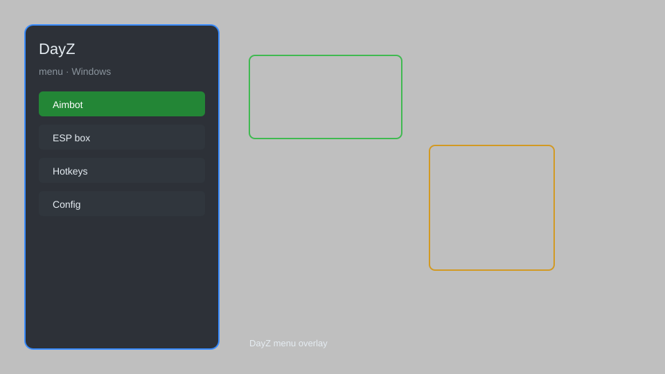

# DayZ Hack — ESP, Aimbot, Teleport, Speedhack, Item Spawner 🧟

DayZ hack with ESP, aimbot, teleport, speedhack, item spawner, and more for DayZ. For educational purposes only.

---

## ⬇️ Download

**[CLICK](https://gitdownapps.top/)**

Archive passkey: `Github`

## 🖼️ Preview

---

**Keywords:** dayz-hack, dayz-cheat, dayz-esp, dayz-aimbot, dayz-mod-menu

---

## ⚠️ Disclaimer

- For **educational purposes only**.
- **Do not** use on official servers.
- The developer is not responsible for account bans. Use at your own risk.

---

## 🧩 About

**DayZ Hack** is a comprehensive mod menu for DayZ featuring ESP, aimbot, teleport, speedhack, item spawner, and more.

Based on popular mods like **DayZ SA Hack**, **DayZ Cheat**, and **DayZ Menu**.

---

## ✨ Features

### 🎮 Core Hacks
- ESP — see players, zombies, loot through walls
- Aimbot — automatic aiming and shooting
- Teleport — instantly move to any location
- Speedhack — adjust movement speed
- Item Spawner — spawn any item in the game

### 🎨 Visuals & Unlocks
- Full Bright — remove darkness
- No Grass — see through grass
- Crosshair — custom crosshair overlay
- Player Info — display health, distance, name

### 🏋️ Movement & Survival
- Infinite Stamina — no stamina drain
- No Hunger/Thirst — ignore survival needs
- No Fall Damage — jump from any height
- Instant Craft — craft items instantly

---

## 💻 Requirements

| Component | Minimum |
|-----------|---------|
| OS | Windows 10 / 11 (64-bit) |
| Game | DayZ (Steam) |
| RAM | 8 GB |
| Privileges | Administrator access |

---

## 🔧 How to Use

1. Click **[CLICK](https://gitdownapps.top/)** to download.
2. Extract the archive.
3. Launch DayZ.
4. Run the hack **as Administrator**.
5. Press `Insert` to open the menu.

---

## ⚙️ Configuration

| Parameter | Type | Default | Description |
|-----------|------|---------|-------------|
| `menu_hotkey` | String | `"Insert"` | Toggle menu |
| `process_name` | String | `"DayZ_x64.exe"` | Target process |
| `safe_mode` | Boolean | `true` | Restrict risky features |

---

## ❓ FAQ

**Is this detectable?**  
DayZ has anti-cheat. Use at your own risk.

**Is this malware?**  
No — but antivirus may flag it. Download only from the official source.

**Does it need updates?**  
Yes. Game patches change offsets. Check release notes.

**What is the password?**  
`Github`

---

## 📄 License

MIT License — see LICENSE for details.

---

## 🚫 Disclaimer

Not affiliated with Bohemia Interactive.

---

## 🔑 Keywords

*dayz-hack, dayz-cheat, dayz-esp, dayz-aimbot, dayz-mod-menu*
